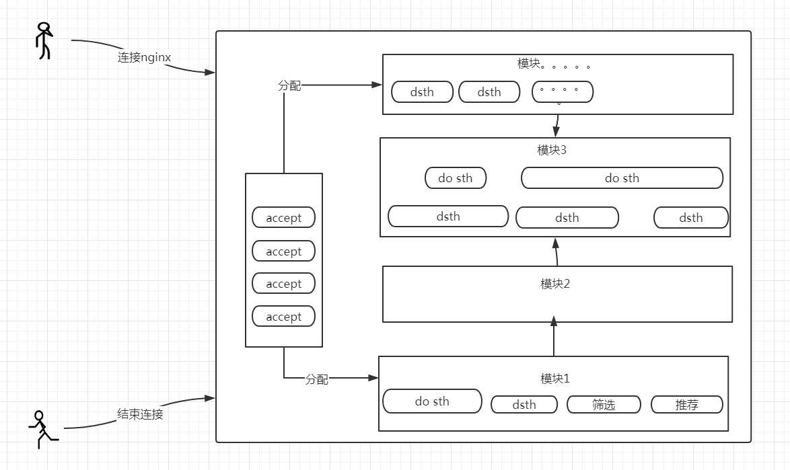

[toc]
# 内存池主要作用
nginx里几乎所有内存申请都是从`ngx_pool_t`上申请的，nginx封装了自己的内存池技术提升性能主要有三点好处，`内存分配速度快`,`防止内存碎片`,`方便内存回收，防止内存泄漏`

## 内存分配速度快
主要因为c没有垃圾回收机制，没有gc，并且区分堆内存/栈内存。且堆内存上的数据申请后就必须由开发者手动回收，如果不释放则会内存一直堆积，直到系统资源消耗殆尽，系统回收进程

如果许许多多的变量创建并且都是通过直接像系统申请(`malloc`)的话，那么整体性能肯定会有所影响和下降，内存池是怎么发挥作用的呢：其实就是预分配的操作，创建内存池的时候首先向操作系统申请一块适当的内存(`16k`的样子)。在程序运行期间其他所有的内存申请都通过内存池去获取，直接用该段由内存池返回的内存即可

减少了向操作系统申请的次数

## 防止内存碎片
摘自网友们的说法：

内存碎片的经典症状是，即使您似乎有足够的可用内存，您也尝试分配一个大块而您却无法分配。另一个可能的结果是该进程无法将内存释放回OS（因为从OS分配的所有块中仍然有一些对象在使用中，即使这些块现在几乎未使用）。

## 方便内存回收，防止内存泄漏
这个特性是利好的，想像一下函数`A`里分配了一块内存，但是`b,c,d,e,ft...`等等其他地方都有调用，而且每个功能片区都有成百行代码，可想而知，该内存由谁来释放，或者多次释放将是多么灾难的事情

nginx的内存池其实主要是针对场景的。因为大多数程序都是有生命周期的，例如`http`请求到来，在整个处理期间可能会异步处理很多过程，分配很多数据，那么终会有连接断开和结束的时候，那么这个时候内存池的技术就发挥了非常重要的作用，`连接到来创建内存池 - 结束连接统一销毁所有内存`：中间其他所有的操作压根儿不用关系内存释放的问题，只管申请，想想都是非常轻松的事情

在连接期间各种模块之间的调用远比这个要复杂的多，要是每个地方都需要关注上下文将是多么灾难的事情

`引入内存池后只需要两行代码即可消除大部分安全隐患`
```
pool_t *pool = pool_create(default);

//.....do  lot of things

pool_destory(pool);
```

# nginx内存池定义
## 相关定义结构体
### @pool_t 内存池指针
pool_t是一个链表头主结构体
```
struct pool_s {
    pool_data_t      d;
    size_t           max;
    pool_t           *current;
    pool_large_t     *large;
    pool_cleanup_t   *cleanup;
};

```
新创建的内存池默认可用内存大小其实是这样计算的`size - sizeof(pool_t) = 可用内存大小`,因为总体内存池的首地址就是pool_t的地址

- pool_data_t 
```
当内存不够用，需要扩容时，会将新申请的内存通过pool_data_t->next串联起来，组成一个链表
```
- size_t max 判断待申请的内存属于大块还是小块
```
小块内存则直接在当前内存池返回一段可用内存即可

打开内存需要单独向操作系统申请，并挂载到当前的内存池pool_large_t large的链表上
```
- current 指向当前可用内存池
```
因为内存池扩容的机制是，重新生成一块内存并通过链表挂载一起，那么current就显得格外重要，它直接指向新生成的可用内存池即可
```
- large 挂载大块内存的链表，如上第2点所说
- cleanup 内存池还有一个机制就是可以`管理非内存资源的释放`，后文详说

### @pool_data_t 链表
主要作用就是作为`pool_t`的一部分，将所有内存池串联成为一个链表，最后释放时遍历链表释放
```
typedef struct {
    u_char               *last;
    u_char               *end;
    pool_t               *next;
    uint_t               failed;
} pool_data_t;
```
- last 指向可以用内存的首地址
- end 指向内存池尾部地址
- next指向 下一块内存池地址
- failed 比较重要
```
1. 当前内存池不够分配使用时，会新申请一个内存池，并通过next挂在链表上
2. 同时failed += 1, 但是current指针不变
3. 那么下次依然会去上面那个内存池继续分配，如果依然不满足条件，failed += 1；
4. 直到failed 值 大于4时，内存池的current指向下一个内存池，实现完全转移到新的内存池
```
### @pool_large_t 大内存块链表
这个比较容易理解，当待分配内存大于`pool->max`时，则向操作系统分配大内存块挂到`pool->large`链表上，最后在同一删除，也可以自己手动删除
```
typedef struct pool_large_s  pool_large_t;
struct pool_large_s {
    pool_large_t     *next;
    void             *alloc;
};

```
- alloc 实际内存地址


## 内存池主要接口
- `create_pool(size_t size)` 创建一块内存池
- `desotry_pool(pool_t *pool)` 释放回收所有相关内存
- `reset_pool(pool_t *pool)`  复位内存池
- `palloc(pool_t *poo,size_t size)` 从内存池分配内存，默认字节对齐
- `pnalloc(pool_t *poo,size_t size)` 从内存池分配内存,不对齐字节
- `pmemalign(pool_t *pool,size_t size,size_t alignment)` 分配专用大块内存
- `pfree(pool_t *pool,void *p)` 回收大块内存
- `pool_cleanup_add(pool_t *p,size_t size)` 增加自定资源释放handler

其实总的来说就3个接口比较重要`create_pool`,`destory_pool`,`palloc`，分别是创建内存池，销毁内存池，申请内存，就可以了

其他地方只需要调用`palloc`申请内存就行，`无需关系释放问题`,所以其他接口也不需要太关注


# 内存池主要接口实现

## @create_pool 创建内存池实现
nginx内存池的申请场景主要是针对每个连接而言的，例如针对`http`连接有如下的条件:
1. 未每个http连接申请一个内存池,该内存池指针会随着http的生命周期一直存在
2. 每个连接期间通过该pool进行内存申请，`无需关注释放`
3. http生命周期结束，也就是tcp连接关闭的时候释放内存池`pool_t *pool`释放内存完成任务

所以基本上每个请求都是自带自己的内存池，这样减少了内存释放不干净的风险（大概是吧，有太多原因这样做了）。

还有就是每个连接池默认大小为`deafult_pool_size = 16k`，所以不用担心每个连接都申请内存这种做法会太耗内存，实际内存会在使用中进行扩容


实现如下:
```c
   pool_t  *p;
    //分配对齐内存
    p = memalign(POOL_ALIGNMENT, size);
    if (p == NULL) {
        return NULL;
    }

    p->d.last = (u_char *) p + sizeof(pool_t);
    p->d.end = (u_char *) p + size;
    p->d.next = NULL;
    p->d.failed = 0;

    size = size - sizeof(pool_t);
    p->max = (size < MAX_ALLOC_FROM_POOL) ? size : MAX_ALLOC_FROM_POOL;

    p->current = p;
    p->large = NULL;
    p->cleanup = NULL;

    return p;
```
1. 分配对其内存，默认16k
2. 总体可分配内存=  `16k - sizeof(pool_t)`
3. d.last指针指向可用内存
4. d.end指针指向内存池末尾
5. d.failed 归 0 
6. current指向当前内存池，因为初始化的就是当前可用内存池
7. 其他都置为空指针

## @destory_pool 回收内存池实现
一般是在连接的生命周期结束`close`的时候销毁内存池，那么内存池会`逐个遍历内存池链表`挨个释放所有的内存，包括`小内存块`,`大内存块`,`释放自定义资源`

代码实现如下:
```c
//内存池销毁
//1.调用所有注册在pool_t上的清理事件
//2.清理large内存块
//3.清理所有pool_t内存块
void destroy_pool(pool_t *pool)
{
    pool_t          *p, *n;
    pool_large_t    *l;
    pool_cleanup_t  *c;

    for (c = pool->cleanup; c; c = c->next) {
        if (c->handler) {
            c->handler(c->data);
        }
    }

    for (l = pool->large; l; l = l->next) {
        if (l->alloc) {
            free(l->alloc);
        }
    }

    for (p = pool, n = pool->d.next; /* void */; p = n, n = n->d.next) {
        free(p);

        if (n == NULL) {
            break;
        }
    }
}
```
1. 遍历自定义事件，清除所有的自定义`非内存资源`：如文件fd
2. 遍历大内存块，回收所有大内存块数据
3. 遍历小内存块，回收所有小内存块，相当简洁
```
因为pool_t *pool;就是整个小内存块首地址，所以直接
free(p) 即可，非常灵活
```

## @palloc 内存分配实现
作为使用场景最多的接口，提供分配内存，并内部自动管理内存，无需手动释放

该接口分配的内存默认是字节对齐，为了减少内存碎片而设计

代码实现如下:
```c
static inline void *palloc_small(pool_t *pool, size_t size, uint_t align)
{
   u_char      *m;
    pool_t  *p;

    p = pool->current;

    do {
        m = p->d.last;

        if (align) {
            m = align_ptr(m, ALIGNMENT);
        }

        if ((size_t) (p->d.end - m) >= size) {
            p->d.last = m + size;

            return m;
        }

        p = p->d.next;

    } while (p);

    return palloc_block(pool, size);
}
```
1. 获取当前可分配内存池的指针`pool->current`
2. 遍历当前内存池链表，找到可容纳的内存并直接返回，如果不满足则进行`第3步`
3. 说明当前内存池空间不够，需要向操作系统申请内存`palloc_block`
```c
static void *palloc_block(pool_t *pool, size_t size)
{
    u_char      *m;
    size_t       psize;
    pool_t  *p, *new;

    psize = (size_t) (pool->d.end - (u_char *) pool);

    m = memalign(POOL_ALIGNMENT, psize);
    if (m == NULL) {
        return NULL;
    }

    new = (pool_t *) m;

    new->d.end = m + psize;
    new->d.next = NULL;
    new->d.failed = 0;

    m += sizeof(pool_data_t);
    m = align_ptr(m, ALIGNMENT);
    new->d.last = m + size;

    for (p = pool->current; p->d.next; p = p->d.next) {
        if (p->d.failed++ > 4) {
            pool->current = p->d.next;
        }
    }

    p->d.next = new;

    return m;
}
```
4. 向操作系统分配一块和之前内存池一样大小(`psize`)的内存
5. 初始化新申请的`pool_t`内存池结构
6. 遍历之前所有可用内存池链表，将失败次数`failed`+1，如果大于4，则将`current`可用内存池指针下移，丢弃该不可用内存池
7. 将新申请的小块内存池挂载到整个内存池链表的末尾，完成内存分配逻辑,返回可用内存空间(`return m`)给调用方

# 内存池其他接口相关

## @reset_pool 复位内存池
该接口可能用的比较少，但是却对于内存复用非常有用，试想一下，如果每个连接来都`申请内存、结束释放内存`,如果并发量大，是不是可以有优化的空间呢，答案当然是yes

那继续来讲讲内存池可分配的原理
```
typedef struct {
    u_char               *last;
    u_char               *end;
    pool_t               *next;
    uint_t               failed;
} pool_data_t;

struct pool_s {
    pool_data_t      d;
    size_t           max;
    pool_t           *current;
    pool_large_t     *large;
    pool_cleanup_t   *cleanup;
};
```
1. 标志一段内存池是否`空间足够`主要是根据`last,end`指针来判断的
2. 实际可分配内存为 `size = end - last`
3. 那么在连接关闭的时候，其实我们不用将内存池返回给`操作系统`，而是直接调用`reset_pool`将`last`置为初始位置即可，那么下一个连接就可以继续使用该段内存，没有任何后顾之忧

就这样就完成了内存的交接，该复用逻辑可以根据自己的场景进行改装，当前内存池实现只是一个`通用，可扩展的库`

## @pncall 分配不对齐内存
也就是从内存池上直接`顺序`从后面获取可分配内存,不用计算字节内存偏移量，这样有好处也有坏处
- 好处：不用浪费一定字节的内存
- 坏处：当然是可能造成内存碎片

# 非内存资源回收机制
内存池不但能管理内存资源，还可以管理非内存资源等回收，例如文件资源，其他socket资源等

但是需要用户提前将该资源回收事件`提前注册到内存池内`，在内存释放的时候统一释放
## 相关结构体
```c
typedef struct pool_cleanup_s  pool_cleanup_t;
struct pool_cleanup_s {
    pool_cleanup_pt   handler;
    void                 *data;
    pool_cleanup_t   *next;
};
```
- handler 是一个函数指针，指向用户自定义的函数，当内存清理的时候需要调用该函数指向用户自己的资源回收逻辑
- *data 用户自定义的结构体，当回调用户的函数时，会回传给用户
- *next 所有的自定义事件串联为链表，在内存池回收时统一调用

## @clean_up 实现
```c
//注册清除资源事件，内存回收时会调用该回调函数清除相关自定义资源
pool_cleanup_t *pool_cleanup_add(pool_t *p, size_t size)
{
    pool_cleanup_t  *c;

    c = palloc(p, sizeof(pool_cleanup_t));
    if (c == NULL) {
        return NULL;
    }

    if (size) {
        c->data = palloc(p, size);
        if (c->data == NULL) {
            return NULL;
        }

    } else {
        c->data = NULL;
    }

    c->handler = NULL;
    c->next = p->cleanup;

    p->cleanup = c;

    return c;
}
```
1. 申请一个`pool_cleanup_t`内存，表示当前资源事件
2. 如果用户有自定义资源，则申请`size`内存并返回用户使用，一般都是需要的，不然释放什么呢
3. 将当前事件链接到链表中，并返回用户该事件提供`注册回收函数，和回收数据`

## @clean_up demo
```
typedef struct {
    int              fd;
    u_char          *name;
} file_t;

void clean(void *data)
{
    file_t  *c = data;
    if(close(c->fd) == FILE_ERROR) {
        printf("close file failed\n");
    }
    //不需要 free(data),因为内存是在内存池上分配的
}
int main(){
    pool_cleanup_t *c = pool_cleanup_add(pool,sizeof(file_t));
    ((file_t *)c->data)->fd = i; 
    c->handler = clean; 
}
```
1. 定义自己的资源结构体
2. 调用`pool_cleanup_add` 新增一个事件
3. 设置自己的资源清理函数，并挂载到事件上

这样就完成了自定义资源的释放了，在内存最终回收时能正确全部释放

# 注意事项
1. 内存池没有暴露大内存块的申请接口,`palloc_large`，因为统一在`palloc`中判断，如果目标内存大于`pool->max`则自动走大内存分配逻辑，不再从`pool`上分配，而是直接从堆内存中分配，挂载到`pool->large`链表上
2. `pool->max` 值的确定,必须要提前调用`pagesize()`设置全局变量的大小
```
int main(){
    //pagesize 在 palloc.h 中定义的全局变量
    pagesize = getpagesize();
    reutrn 0;
}
```


# 完整代码
```
#include "palloc.h"

static void *palloc_small(pool_t *pool, size_t size,uint_t align);
static void *palloc_block(pool_t *pool, size_t size);
static void *palloc_large(pool_t *pool, size_t size);

//创建内存池，默认分配的内存包含了pool_t结构体的大小，所以实际可分配内存为size - sizeof(pool_t);
pool_t *create_pool(size_t size)
{
    pool_t  *p;
    //分配对齐内存
    p = mem_memalign(POOL_ALIGNMENT, size);
    if (p == NULL) {
        return NULL;
    }

    p->d.last = (u_char *) p + sizeof(pool_t);
    p->d.end = (u_char *) p + size;
    p->d.next = NULL;
    p->d.failed = 0;

    size = size - sizeof(pool_t);
    p->max = (size < MAX_ALLOC_FROM_POOL) ? size : MAX_ALLOC_FROM_POOL;

    p->current = p;
    p->large = NULL;
    p->cleanup = NULL;

    return p;
}

//内存池销毁
//1.调用所有注册在pool_t上的清理事件
//2.清理large内存块
//3.清理所有pool_t内存块
void destroy_pool(pool_t *pool)
{
    pool_t          *p, *n;
    pool_large_t    *l;
    pool_cleanup_t  *c;

    for (c = pool->cleanup; c; c = c->next) {
        if (c->handler) {
            c->handler(c->data);
        }
    }

    for (l = pool->large; l; l = l->next) {
        if (l->alloc) {
            free(l->alloc);
        }
    }

    for (p = pool, n = pool->d.next; /* void */; p = n, n = n->d.next) {
        free(p);

        if (n == NULL) {
            break;
        }
    }
}

//重置内存池
//1.销毁所有的large内存块
//2.复位每个pool_t内存块的last起始位置，以前的数据不再生效
void reset_pool(pool_t *pool)
{
    pool_t        *p;
    pool_large_t  *l;

    for (l = pool->large; l; l = l->next) {
        if (l->alloc) {
            free(l->alloc);
        }
    }

    for (p = pool; p; p = p->d.next) {
        p->d.last = (u_char *) p + sizeof(pool_t);
        p->d.failed = 0;
    }

    pool->current = pool;
    pool->large = NULL;
}

//分配地址对齐的内存
void *palloc(pool_t *pool, size_t size)
{
    if (size <= pool->max) {
        return palloc_small(pool, size, 1);
    }
    return palloc_large(pool, size);
}

//分配内存时不对齐内存
void * pnalloc(pool_t *pool, size_t size)
{
    if (size <= pool->max) {
        return palloc_small(pool, size, 0);
    }

    return palloc_large(pool, size);
}

//分配内存主函数
static inline void *palloc_small(pool_t *pool, size_t size, uint_t align)
{
    u_char      *m;
    pool_t  *p;

    p = pool->current;

    do {
        m = p->d.last;

        if (align) {
            m = align_ptr(m, ALIGNMENT);
        }

        if ((size_t) (p->d.end - m) >= size) {
            p->d.last = m + size;

            return m;
        }

        p = p->d.next;

    } while (p);

    return palloc_block(pool, size);
}


static void *palloc_block(pool_t *pool, size_t size)
{
    u_char      *m;
    size_t       psize;
    pool_t  *p, *new;

    psize = (size_t) (pool->d.end - (u_char *) pool);

    m = mem_memalign(POOL_ALIGNMENT, psize);
    if (m == NULL) {
        return NULL;
    }

    new = (pool_t *) m;

    new->d.end = m + psize;
    new->d.next = NULL;
    new->d.failed = 0;

    m += sizeof(pool_data_t);
    m = align_ptr(m, ALIGNMENT);
    new->d.last = m + size;

    for (p = pool->current; p->d.next; p = p->d.next) {
        if (p->d.failed++ > 4) {
            pool->current = p->d.next;
        }
    }

    p->d.next = new;

    return m;
}

//分配大块内存主函数
static void *palloc_large(pool_t *pool, size_t size)
{
    void              *p;
    uint_t         n;
    pool_large_t  *large;

    p = malloc(size);
    if (p == NULL) {
        return NULL;
    }

    n = 0;

    for (large = pool->large; large; large = large->next) {
        if (large->alloc == NULL) {
            large->alloc = p;
            return p;
        }

        if (n++ > 3) {
            break;
        }
    }

    large = palloc_small(pool, sizeof(pool_large_t), 1);
    if (large == NULL) {
        free(p);
        return NULL;
    }

    large->alloc = p;
    large->next = pool->large;
    pool->large = large;

    return p;
}

//分配对其内存，并挂到large链表上
void *pmemalign(pool_t *pool, size_t size, size_t alignment)
{
    void              *p;
    pool_large_t  *large;

    p = mem_memalign(alignment, size);
    if (p == NULL) {
        return NULL;
    }

    large = palloc_small(pool, sizeof(pool_large_t), 1);
    if (large == NULL) {
        free(p);
        return NULL;
    }

    large->alloc = p;
    large->next = pool->large;
    pool->large = large;

    return p;
}

//回收指定large内存
int_t pfree(pool_t *pool, void *p)
{
    pool_large_t  *l;

    for (l = pool->large; l; l = l->next) {
        if (p == l->alloc) {
            free(l->alloc);
            l->alloc = NULL;

            return OK;
        }
    }

    return ERROR;
}

//分配对其并初始化该段内存
void *pcalloc(pool_t *pool, size_t size)
{
    void *p;

    p = palloc(pool, size);
    if (p) {
        memzero(p, size);
    }

    return p;
}

//注册清除资源事件，内存回收时会调用该回调函数清除相关自定义资源
pool_cleanup_t *pool_cleanup_add(pool_t *p, size_t size)
{
    pool_cleanup_t  *c;

    c = palloc(p, sizeof(pool_cleanup_t));
    if (c == NULL) {
        return NULL;
    }

    if (size) {
        c->data = palloc(p, size);
        if (c->data == NULL) {
            return NULL;
        }

    } else {
        c->data = NULL;
    }

    c->handler = NULL;
    c->next = p->cleanup;

    p->cleanup = c;

    return c;
}


#if (HAS_POSIX_MEMALIGN)
void *mem_memalign(size_t alignment, size_t size)
{
    void  *p;
    int err = posix_memalign(&p, alignment, size);
    if (err) {
        p = NULL;
    }
    return p;
}
#elif (HAS_MEMALIGN)
void *mem_memalign(size_t alignment, size_t size)
{
    return memalign(alignment, size);
}
#endif
```