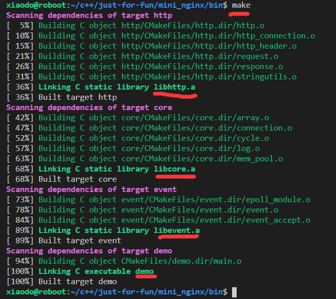
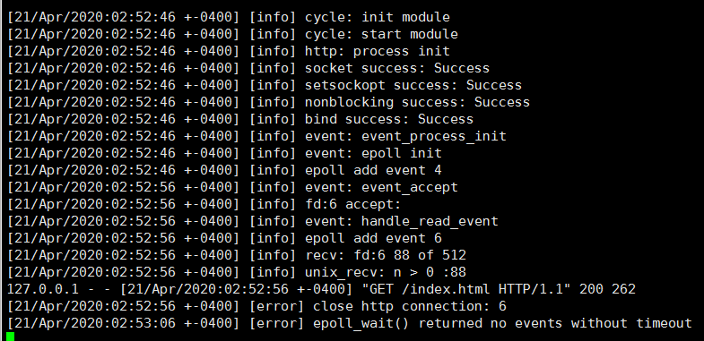

# mini_ngx_实现一-简述
https://wiki.brewlin.com/wiki/github/nginx/mini_ngx/1.mini_ngx_%E5%AE%9E%E7%8E%B0%E4%B8%80-%E7%AE%80%E8%BF%B0/
# mini_ngx_实现二-core模块
https://wiki.brewlin.com/wiki/github/nginx/mini_ngx/2.mini_ngx_%E5%AE%9E%E7%8E%B0%E4%BA%8C-core%E6%A8%A1%E5%9D%97/
# mini_ngx_实现三-http模块
https://wiki.brewlin.com/wiki/github/nginx/mini_ngx/3.mini_ngx_%E5%AE%9E%E7%8E%B0%E4%B8%89-http%E6%A8%A1%E5%9D%97/
# mini_ngx_实现四-event模块
https://wiki.brewlin.com/wiki/github/nginx/mini_ngx/4.mini_ngx_%E5%AE%9E%E7%8E%B0%E5%9B%9B-event%E6%A8%A1%E5%9D%97/

# demo

